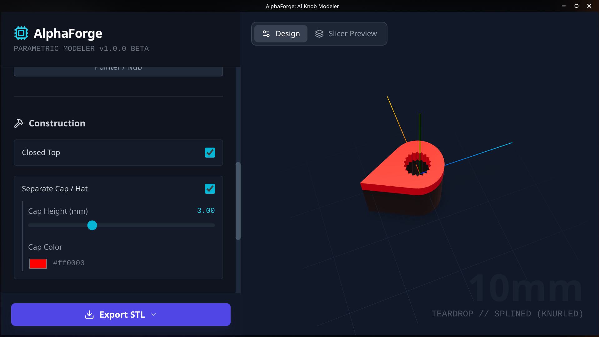

# AlphaForge Knob Modeler

**AI-Powered 3D Knob Designer for 3D Printing**


Transform your ideas into custom 3D-printable knobs using natural language and AI. AlphaForge Knob Modeler is a cross-platform desktop application that lets you design intricate knobs for synthesizers, guitar pedals, audio equipment, and more without any 3D modeling experience.

---

## Features

- **AI-Powered Design**: Describe your knob in plain English and let AI generate the 3D model
- **Real-Time 3D Preview**: Interactive visualization with rotation, zoom, and lighting controls
- **Parametric Controls**: Fine-tune dimensions like diameter, height, grip style, and shaft size
- **Light/Dark Mode**: Toggle between light and dark themes for comfortable use in any environment
- **STL Export**: Export ready-to-print STL files for your 3D printer
- **Cross-Platform**: Runs on Windows, macOS, and Linux
- **Secure**: API keys are safely stored in the main process, never exposed to frontend code
- **Production-Ready**: Built with Electron, memory-optimized, error handling, and professionally packaged
- **Accessible**: Improved keyboard navigation and mobile-friendly touch targets

---

## Download

### Latest Release: v1.1.0

#### Windows
- [Installer (.exe)](../../releases/download/v1.1.0/AlphaForge.Knob.Modeler.Setup.1.1.0.exe) (Recommended)
- [Portable (.exe)](../../releases/download/v1.1.0/AlphaForge.Knob.Modeler.1.1.0.exe)

#### Linux
- [AppImage](../../releases/download/v1.1.0/AlphaForge.Knob.Modeler-1.1.0.AppImage) (Portable)

#### Android
- [APK (Signed)](../../releases/download/v1.1.0/AlphaForge-Knob-Modeler.apk) - *Enable "Unknown Sources" to install*

#### macOS
- Coming soon

---

## Gallery

| Main Interface | Model Preview |
|:---:|:---:|
|  |  |

---

## What's New in v1.1.0

### Major Improvements
- **🌓 Light/Dark Mode**: Full theme support with seamless switching
- **🛡️ Enhanced Security**: Removed API key exposure vulnerabilities
- **⚡ Performance Optimizations**: Memoized validation functions and improved rendering
- **♿ Accessibility**: Better ARIA labels and 44px minimum touch targets for mobile
- **🎨 UI Polish**: Theme-aware tooltips, toasts, and modals
- **🐛 Memory Management**: Fixed geometry disposal to prevent memory leaks
- **💪 Production Ready**: Error boundaries and graceful error handling

### Known Issues
- **Shaft Diameter Accuracy:** The hole diameter for the shaft may be slightly tight or loose depending on your printer's calibration. Tolerance calculation needs adjustment.
- **Workaround:** Slightly adjust the "Shaft Diameter" slider in the "Shaft Fit" section to compensate for your printer's tolerance (e.g., add 0.2mm - 0.4mm).

---

## Contributing & Help Wanted

I am an independent open-source developer and **help is very welcome!**

If you are a developer, 3D printing enthusiast, or UI/UX designer, here is how you can help:
- **Test:** Download the app, print some knobs, and report your results.
- **Code:** Check the "Issues" tab for bugs or feature requests.
- **Documentation:** Improve my guides and examples.

Feel free to open an issue or submit a pull request!

---

## Installation

### Windows

1. Download the **Setup** `.exe` file from the [latest release](../../releases/latest).
2. Run the installer.
3. The app will launch automatically.
4. (Optional) You can also use the **Portable** version if you prefer not to install it.

### Linux

**AppImage (Recommended)**
```bash
# Download and make executable (replace version number with latest)
chmod +x AlphaForge.Knob.Modeler-1.1.0.AppImage
./AlphaForge.Knob.Modeler-1.1.0.AppImage
```

**Debian/Ubuntu (.deb)**
```bash
sudo dpkg -i alphaforge-ai-knob-modeler_1.1.0_amd64.deb
```

### macOS
Coming soon

---

## Setup

### Getting a Gemini API Key

1. Visit [Google AI Studio](https://makersuite.google.com/app/apikey)
2. Create a new API key
3. Launch AlphaForge Knob Modeler
4. Enter your API key in the settings when prompted
5. The key is securely stored and never exposed

---

## Development

### Prerequisites

- Node.js (v16 or higher)
- npm or yarn

### Run Locally

```bash
# Clone the repository
git clone https://github.com/yourusername/alphaforge-knob-modeler.git
cd alphaforge-knob-modeler

# Install dependencies
npm install

# Set up environment variables
echo "GEMINI_API_KEY=your_api_key_here" > .env.local

# Run in development mode
npm run electron:dev
```

### Build Commands

```bash
# Development
npm run electron:dev           # Run with hot reload

# Production Builds
npm run electron:build:linux   # Build Linux packages
npm run electron:build:win     # Build Windows installers
npm run electron:build:mac     # Build macOS packages
npm run electron:build:all     # Build for all platforms

# Clean builds
npm run build:clean            # Remove dist folders
```

---

## Technology Stack

- **Frontend**: React 19, TypeScript, Three.js, React Three Fiber
- **Desktop**: Electron 39
- **AI**: Google Gemini API
- **3D Rendering**: Three.js with @react-three/fiber and @react-three/drei
- **Build**: Vite, electron-builder
- **Icons**: Lucide React

---

## Security Features

- API keys stored securely in Electron main process
- IPC-based communication between renderer and main process
- No sensitive data exposed in frontend JavaScript
- Production logging for debugging without compromising security

---

## Architecture

```
alphaforge-knob-modeler/
├── App.tsx                 # Main React application
├── components/             # React components
│   ├── KnobMesh.tsx       # 3D knob renderer
│   └── ...
├── services/              # Business logic
│   └── geminiService.ts   # AI service (IPC-based)
├── electron.cjs           # Electron main process
├── preload.cjs           # Secure IPC bridge
├── build/                # Application icons
├── dist/                 # Vite build output
└── dist-electron/        # Electron packages
```

---

## Memory Management & Performance

- Automatic Three.js geometry and material disposal
- URL object cleanup after exports
- Proper React cleanup hooks
- Memoized validation functions
- Production-tested for long-running sessions
- Error boundaries to catch and handle rendering errors gracefully

---

## Roadmap

- [x] Windows builds
- [ ] macOS builds
- [ ] Code signing for trusted distribution
- [x] Auto-updates via GitHub Releases
- [ ] Save/Load project files (.knob format)
- [ ] Additional export formats (OBJ, 3MF)
- [ ] Keyboard shortcuts (Ctrl+S, Ctrl+E)
- [ ] User preferences/settings persistence
- [ ] Recent files menu

---

## Contributing

Contributions are welcome! Please feel free to submit a Pull Request.

1. Fork the repository
2. Create your feature branch (`git checkout -b feature/AmazingFeature`)
3. Commit your changes (`git commit -m 'Add some AmazingFeature'`)
4. Push to the branch (`git push origin feature/AmazingFeature`)
5. Open a Pull Request

---

## License

This project is licensed under the MIT License - see the [LICENSE](LICENSE) file for details.

---

## Acknowledgments

- Built with [Electron](https://www.electronjs.org/)
- Powered by [Google Gemini AI](https://ai.google.dev/)
- 3D rendering by [Three.js](https://threejs.org/)
- Icons by [Lucide](https://lucide.dev/)

---

## Support

For issues, questions, or suggestions, please [open an issue](../../issues) on GitHub.

---

**Made with passion for makers, musicians, and creators.**
